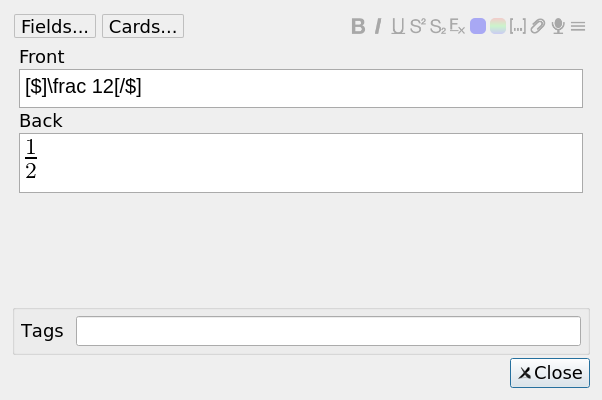

# Uses tex as image in editor/reviewer
## Rationale
Most of the time, I don't care about the LaTeX code, appart when I want to edit it. I prefer to see the LaTeX's compilation result. So this add-on does just that. Editor and browser show the result of LaTeX compilation. And you see the LaTeX code only when you click on the field you want to edit.

## Warning
### Risk
This add-on is still quite new. (As of january 2020). It's possible that I missed some bug. I believe that it may theoretically be possible that Anki stops knowing that the image was generated by LaTeX and consider this as a normal image. Which means you could not easily edit the content anymore. I have never seen this bug occuring, but I can't promise it will never occur.

### Incompatible add-ons
This add-on is not compatible with any other add-on affecting the
reviewer. In particular [frozen field](https://ankiweb.net/shared/info/516643804), [Multi-column note editor](https://ankiweb.net/shared/info/3491767031) and [Advanced note editor](https://ankiweb.net/shared/info/2064123047). It'll eventually be incorporated in this last add-on. 

## Technical

The note editor is actually an html page. Each time a field is edited,
javascripts sends the new value to python, which eventually save the
value in the database. For this reason, I need to ensure that images
are replaced by original TeX as soon as the user click in the
field. This leaves less freedom that what I would have wanted to
do. Most of the features in TODO seems too risky to implement right
now.

## Internal
It changes the javascript methods:
* onFocus
* setFields

and the python methods:
* aqt.editor.Editor.loadNote
* aqt.editor.Editor.setupWeb

## Version 2.0
None

## TODO
### Save TeX in tag
Save original tex in html image tag. So that if the bug I consider
above occurs, tex can be taken back. 

### Replace by TeX code when clicking on image
Currently, as soon as field is selected, LaTeX code come back. It may
be better to do this change when we click on image. I'll see when I
use the add-on whether I find it worth to take the time to implement
this feature.

### When opening editor, do not select first field.
This way, we can see the imagen of the first field tex.

## Links, licence and credits

Key         |Value
------------|-------------------------------------------------------------------
Copyright   | Arthur Milchior <arthur@milchior.fr>
Based on    | Anki code by Damien Elmes <anki@ichi2.net>
License     | GNU AGPL, version 3 or later; http://www.gnu.org/licenses/agpl.html
Source in   | https://github.com/Arthur-Milchior/anki-
Addon number| [882784122](https://ankiweb.net/shared/info/882784122)
Support me on|  or 
